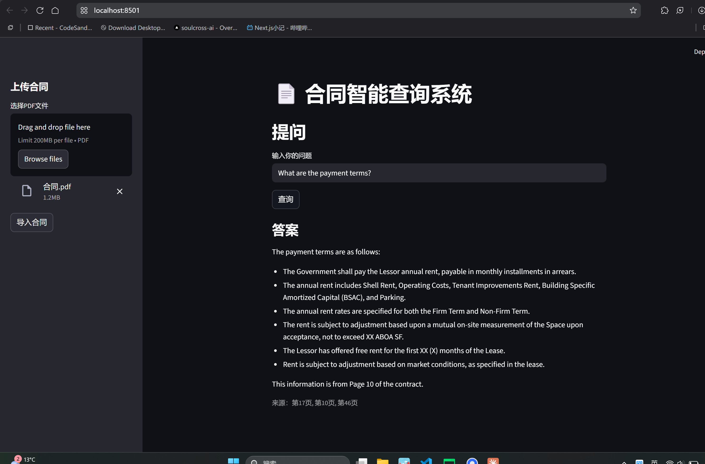

# 合同智能查询系统

基于 RAG 架构的合同分析工具，上传 PDF 合同后可用自然语言直接提问，返回答案及来源页码。

## 技术栈
- 向量检索：ChromaDB + 智谱 Embedding
- 生成模型：GLM-4-flash
- 界面：Streamlit

## 功能
- PDF 合同上传与解析
- 自然语言查询合同内容
- 返回答案及来源页码定位

## 测试数据

可从以下来源获取测试用PDF合同：
- [LawDepot](https://www.lawdepot.com) - 免费合同模板
- Google搜索：`real estate loan agreement filetype:pdf`

## 快速开始

1. 安装依赖
pip install -r requirements.txt

2. 配置 API Key
复制 .env.example 为 .env，填入智谱 API Key

3. 启动
streamlit run app.py

## 后续规划
- 替换为 OpenAI Embeddings + pgvector（生产环境）
- FastAPI 后端 + 前端界面
- Google Drive 自动同步
- 合同到期自动提醒

- ## ⚠️ 实践中的问题与优化

在实际测试过程中，发现统一使用“段落级 chunking”并不适用于所有文档类型，尤其是在处理结构化 PDF（如法律合同模板、政府文件、带大量表格和编号的文档）时，会出现明显的检索效果下降问题。

### 问题表现

- 无法检索到明显存在的关键词（如 payment、rent 等）
- 调整 top_k 或改写问题后仍无法召回相关内容
- 检索到的 chunk 多为：
  - 标题（如 SECTION / 条款编号）
  - 表格碎片
  - 不完整句子

### 原因分析

- 此类 PDF 并非自然段文本，而是“版式驱动”的结构化文档
- pdfplumber 提取后文本结构被打散，段落边界不可靠
- 段落切分导致语义被过度碎片化（chunk 过小或不完整）
- embedding 检索依赖语义完整性，对碎片文本效果较差

### 当前结论

👉 段落级 chunking 更适用于：
- TXT / DOCX
- FAQ / 说明文档
- 自然语言结构清晰的文本

👉 对于结构化 PDF，更合适的策略是：
- 按页切分（page-level chunking）
- 或在页内进行定长切分（fixed-size chunking）

### 下一步优化方向

- 👉 分层判断文档适合什么chunk再去执行

第一层（规则）
文件类型（pdf / docx）
行长度分布
是否有 section / article
第二层（简单统计）
平均行长度
标题比例
换行密度
第三层（可选 LLM）
复杂场景才用
  - TXT / DOCX：段落优先
- 引入 hybrid search（语义 + 关键词）
- 增强 query 扩写能力（如 payment → rent / consideration）

## 界面预览

